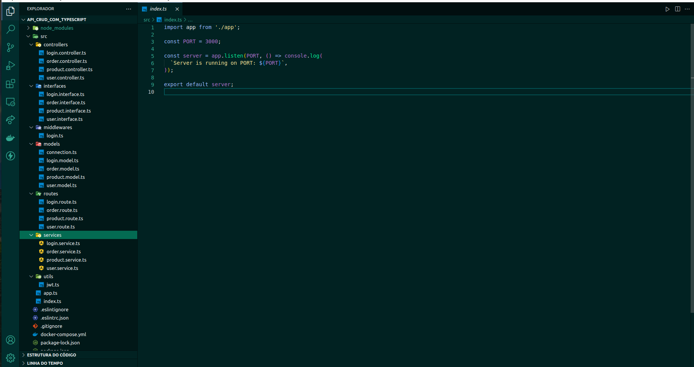

# API CRUD com TypeScript

Desenvolvimento de um CRUD (Create, Read, Update e Delete) de itens medievais, no formato de uma API, utilizando Typescript.

## Instalação

Instale API_CRUD_com_TypeScript usando npm

```bash
  git clone git@github.com:nataliakoliveira/API_CRUD_com_TypeScript.git
  cd API_CRUD_com_TypeScript
  npm install
```
    
## Stack utilizada

**Back-end:** Express, Sequelize, MySQL, TypeScript, Docker


## Screenshots

)

